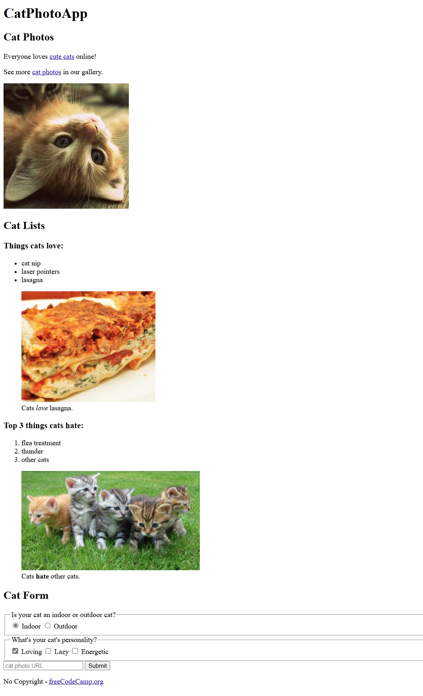

# Learn HTML by building a Cat Photo App 🐱

**Proyecto 1: Aprende HTML construyendo una aplicación de fotos de gatos**  
Comienzo de la certificación de **Diseño Web Responsivo** de FreeCodeCamp.  
Primeros pasos en HTML: aprendizaje de sintaxis básica y elemental de HTML, con diferentes tipografías, añadido de imágenes, creación de listas, selección, botones simples y enlaces.

## Contacto
- LinkedIn: [www.linkedin.com/in/josem-garcia-](https://www.linkedin.com/in/josem-garcia-)

## Tecnologías utilizadas
- HTML5  
- Responsive Design (conceptos básicos)

## Cómo ver el proyecto
- Simplemente abre el archivo `index.html` en tu navegador web favorito para ver la página funcionando.  
- Explora la estructura HTML y los estilos CSS aplicados.

