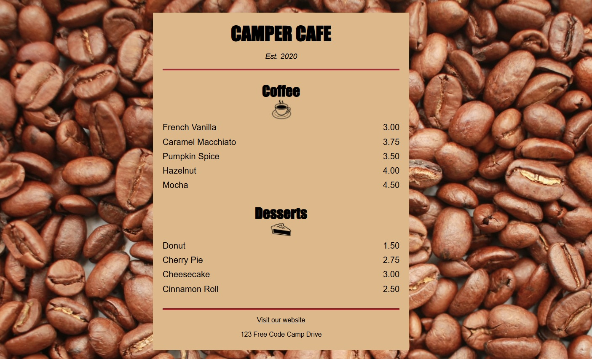

Learn HTML by building a Cat Photo App
Proyecto 2: Aprende CSS Básico construyendo la Carta de una Cafetería 🍰☕
Continuación de primeros pasos en HTML, además de introducción a CSS.

LinkedIn: www.linkedin.com/in/josem-garcia-

