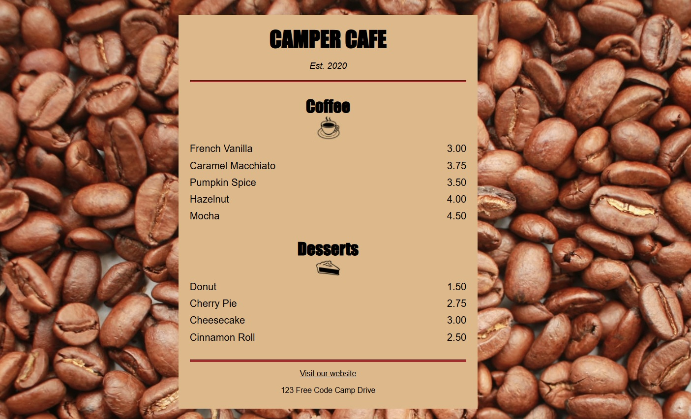

# Proyecto 2: Aprende CSS Básico construyendo la Carta de una Cafetería 🍰☕

Este proyecto es parte de la serie **"Aprende HTML y CSS"**, donde damos los primeros pasos en el desarrollo web creando interfaces sencillas y prácticas.  

En este ejercicio, construirás la **carta de un café** usando HTML para la estructura y CSS para darle estilo, aprendiendo conceptos básicos de diseño y maquetación.

## Tecnologías utilizadas
- **HTML5**: para la estructura de la página.
- **CSS3**: para estilos y presentación visual.
- **Buenas prácticas**: organización de archivos, nombres semánticos y accesibilidad básica.

LinkedIn: www.linkedin.com/in/josem-garcia-

