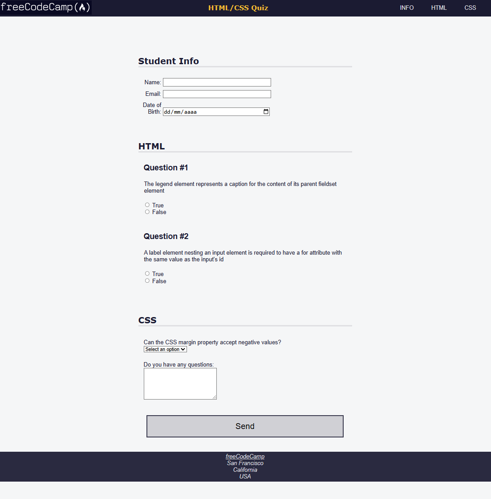

# Accessibility Quiz - HTML/CSS Practice Project

## Descripción
Este proyecto es una práctica de HTML y CSS basada en el **Accessibility Quiz** de freeCodeCamp. Su objetivo es reforzar conceptos de accesibilidad web y buenas prácticas en la creación de formularios, navegación y estilos, aplicando técnicas como **etiquetas semánticas, roles ARIA y navegación accesible**.

## Contacto
- LinkedIn: [www.linkedin.com/in/josem-garcia-](https://www.linkedin.com/in/josem-garcia-)

## Características principales
- Formularios con campos para nombre, correo y fecha de nacimiento.
- Preguntas de HTML y CSS con opciones de selección múltiple.
- Uso de elementos semánticos `<fieldset>`, `<legend>`, `<label>` y `<input>`.
- Implementación de navegación accesible y menú responsivo.
- Estilos adaptativos usando CSS moderno y `@media` queries.
- Compatibilidad con preferencias de movimiento reducidas (`prefers-reduced-motion`).

## Tecnologías utilizadas
- HTML5
- CSS3
- Principios de accesibilidad web (WCAG)
- Navegación semántica y roles ARIA

## Estructura del proyecto
/project-root
│
├─ index.html # Página principal con formulario y quiz
├─ styles.css # Estilos principales y adaptativos
└─ README.md # Documentación del proyecto

## Requisitos previos
- Navegador moderno (Chrome, Firefox, Edge)
- Conexión a Internet para acceder al recurso de freeCodeCamp (logo y enlace de envío)

## Ejecución del proyecto
1. Clonar o descargar este repositorio.
2. Abrir `index.html` en tu navegador.
3. Completar el formulario y responder las preguntas.
4. Hacer clic en **Send** para enviar las respuestas al endpoint de freeCodeCamp.

## Valor para el mercado laboral
Este proyecto demuestra:
- Capacidad para crear interfaces accesibles y semánticas.
- Habilidad en la implementación de buenas prácticas de HTML/CSS.
- Conocimiento de técnicas de UX y accesibilidad web.

## Próximos pasos
- Añadir validación de formulario con JavaScript.
- Mejorar la responsividad y accesibilidad en dispositivos móviles.
- Integrar un sistema de puntuación automático para el quiz.

## Vista previa

