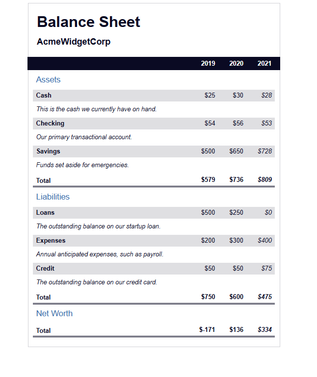

📊 Balance Sheet - AcmeWidgetCorp

Visualización interactiva de los estados financieros de AcmeWidgetCorp a lo largo de los años 2019, 2020 y 2021. Presenta Assets (Activos), Liabilities (Pasivos) y Net Worth (Patrimonio Neto) de forma clara, accesible y visual.

📫 Contacto

LinkedIn: [www.linkedin.com/in/josem-garcia-](https://www.linkedin.com/in/josem-garcia-)

✨ Características Principales

Tablas separadas para Assets, Liabilities y Net Worth.

Valores actuales (2021) destacados en cursiva.

Encabezado sticky con los años para fácil referencia.

Accesibilidad: descripciones ocultas para lectores de pantalla (sr-only).

Estilo moderno y responsivo, con gradientes y resaltado al pasar el cursor sobre totales.

🛠 Tecnologías Utilizadas

HTML5: estructura semántica.

CSS3: flexbox, gradientes, estilos de tablas y sticky headers.

Accesibilidad: sr-only, descripciones de conceptos financieros.

Responsive Design: adaptable a distintos tamaños de pantalla.

📂 Estructura del Proyecto

/project-root
│
├─ index.html        # Página principal con Balance Sheet
├─ styles.css        # Estilos visuales y accesibles
└─ README.md         # Documentación del proyecto

Valor para el Mercado Laboral

Demuestra habilidades en maquetación HTML/CSS avanzada.

Práctica en accesibilidad web y buenas prácticas de UI/UX.

Uso de tablas complejas y sticky headers, muy útil para dashboards financieros.

